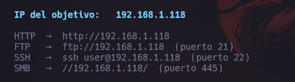
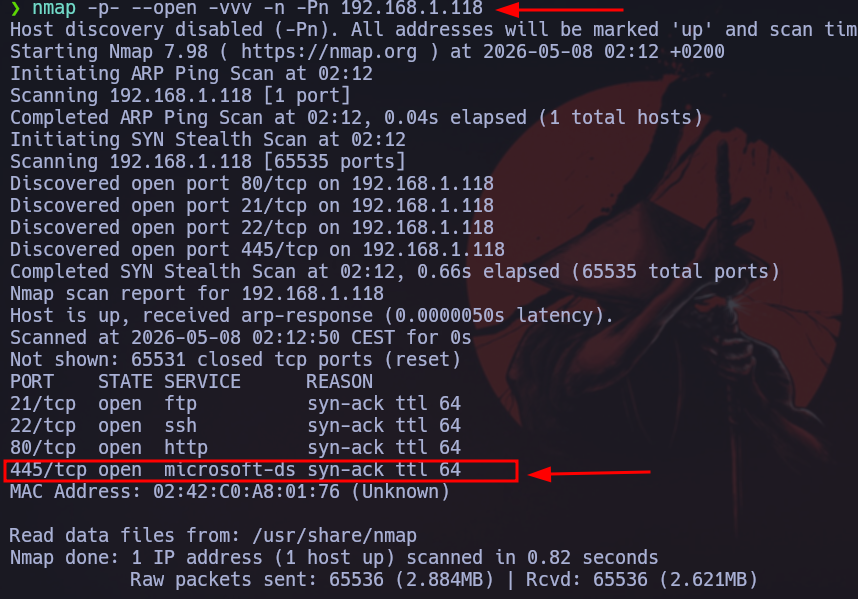
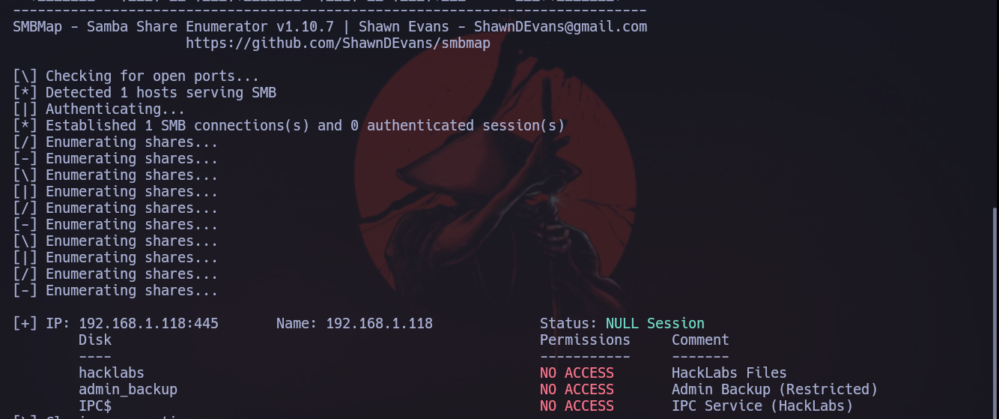
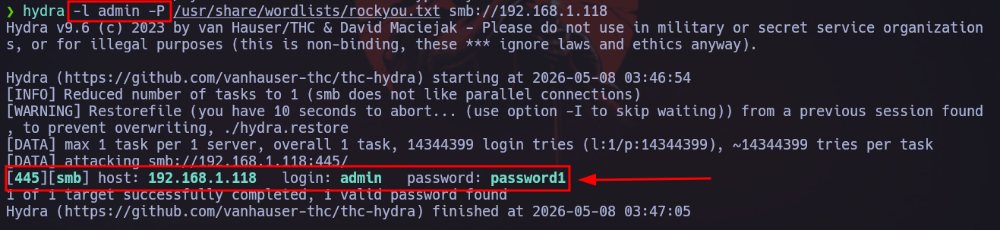
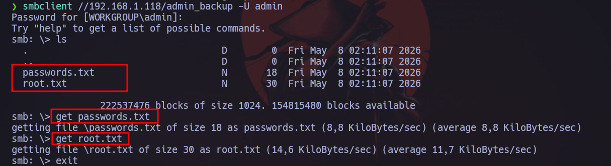
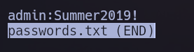
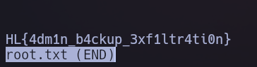

# 🔐 Laboratorio SMB - Enumeración y Explotación

## 🎯 Objetivo

El objetivo de este laboratorio es analizar la seguridad del servicio SMB (puerto 445), realizando tareas de reconocimiento, enumeración y explotación para identificar posibles vulnerabilidades.

---

## 🧠 1. Reconocimiento inicial

Se inicia la máquina víctima en un entorno controlado.

---

## 📡 2. Escaneo de puertos

Se realiza un escaneo con Nmap para identificar puertos abiertos en la dirección IP `192.168.1.118`.

Se detecta el puerto **445/TCP**, correspondiente al servicio SMB.

---

## 📂 3. Enumeración del servicio SMB

Se utiliza la herramienta `smbmap` para identificar recursos compartidos en el sistema.

El resultado indica que no se tiene acceso a los recursos compartidos sin credenciales válidas.

---

## 🔓 4. Ataque de fuerza bruta

Se realiza un ataque de fuerza bruta utilizando Hydra para intentar obtener credenciales válidas.

hydra -l admin_backup -P /usr/share/wordlists/rockyou.txt smb://192.168.1.118

Se identifica que el usuario correcto es admin tras pruebas de enumeración adicionales.

🔎 5. Enumeración de usuarios

Se utiliza enum4linux para obtener información adicional del sistema.

Se confirma la existencia del usuario admin.

🔑 6. Acceso al servicio SMB

Se utiliza smbclient para acceder al recurso compartido utilizando las credenciales obtenidas.

Dentro del recurso se encuentran dos archivos, los cuales son descargados utilizando el comando get.

📄 7. Análisis de archivos

Al analizar los archivos descargados, se obtiene información sensible.

Se encuentra una contraseña:

Summer2019!

🧾 8. Acceso final y obtención de la flag

Utilizando la información obtenida, se logra acceder al sistema objetivo.

Se obtiene la flag del sistema:

HL{4dm1n_b4ckup_3xf1ltr4ti0n}
🏁 Conclusión

En este laboratorio se aplicaron técnicas de reconocimiento, enumeración y explotación sobre el protocolo SMB (puerto 445).

Se logró:

Identificar el servicio SMB expuesto
Enumerar usuarios del sistema
Obtener credenciales mediante técnicas de fuerza bruta y análisis
Acceder al recurso compartido
Extraer información sensible
Obtener la flag final
📚 Aprendizajes
Enumeración de servicios SMB
Uso de herramientas como:
Nmap
smbmap
hydra
enum4linux
smbclient
Importancia de la seguridad en servicios expuestos en red
Impacto de credenciales débiles o expuestas

🧠 Reflexión personal

Este laboratorio presentó dificultades en la fase de obtención de credenciales, lo que permitió reforzar habilidades de análisis, persistencia y uso de herramientas de seguridad ofensiva. La experiencia fue clave para comprender cómo pequeños errores de configuración pueden comprometer completamente un sistema.
